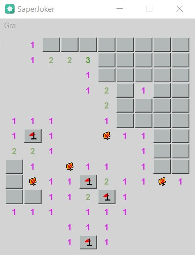

# SaperJoker
Mini project written in QT Creator C++

## Description of the game
MinesweeperJoker is an ordinary sapper game.
The problem is that not all numbers are shown, but only the Joker icon.
The Joker icon means that there is at least one mine next to it

